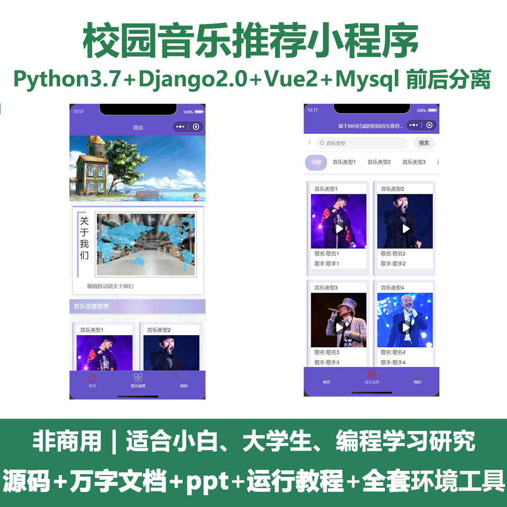
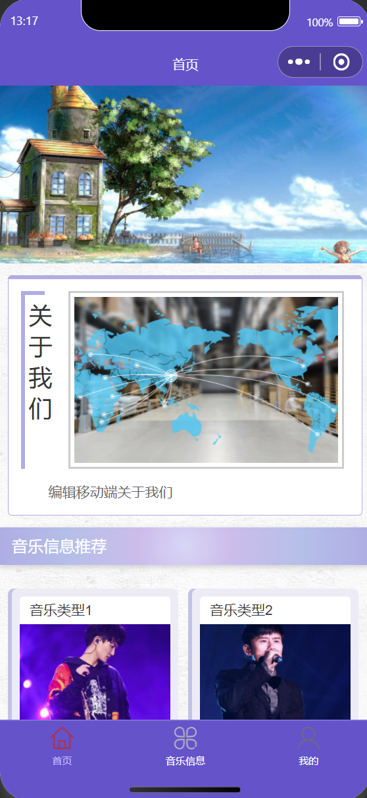
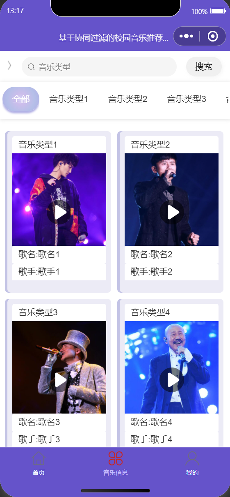
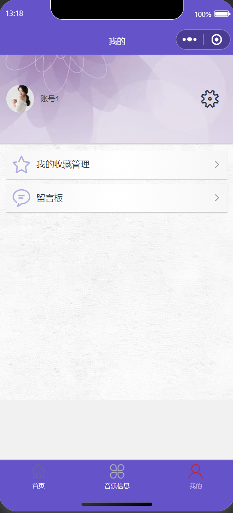
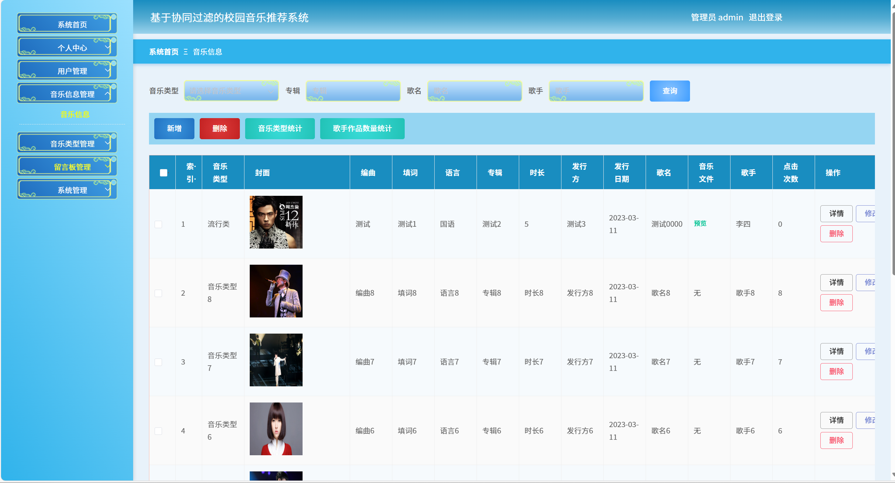
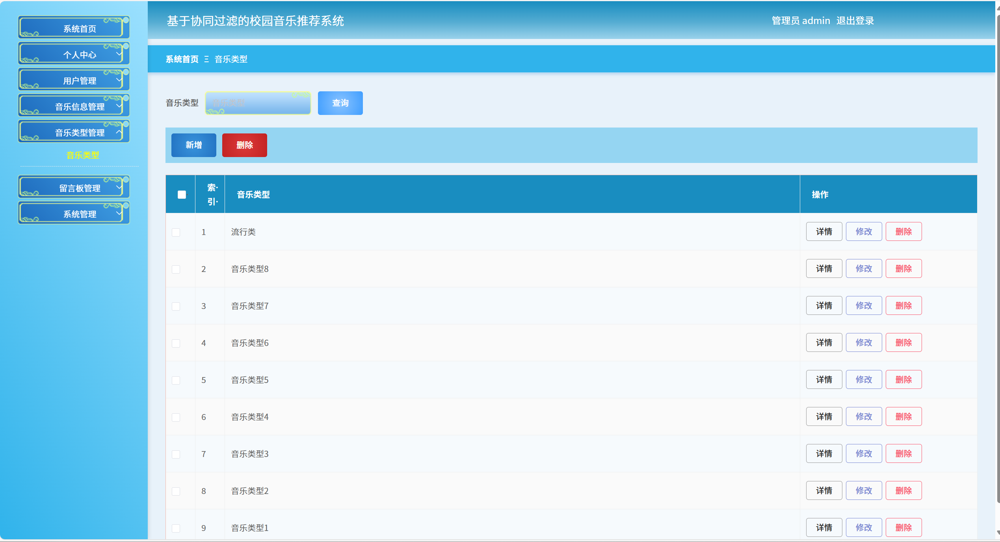
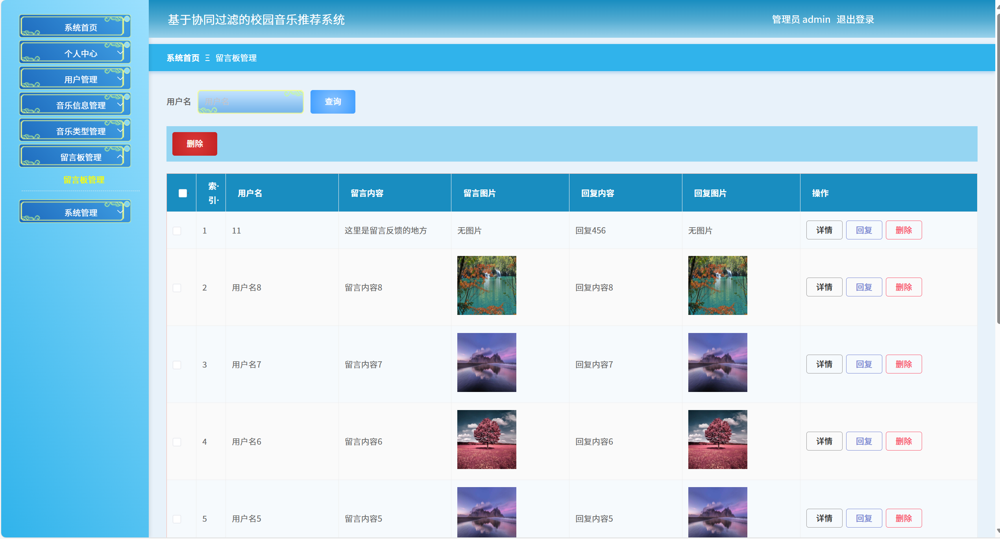
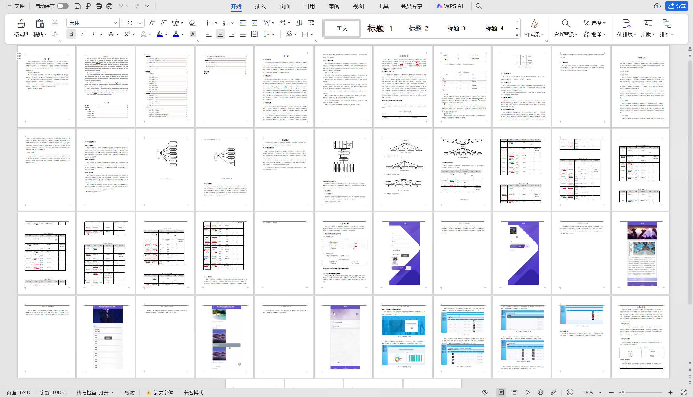

 
## 查看主页获取源码

### 一、关键词
校园音乐甄选小程序，校园乐单推荐小程序，校园场景音乐推荐小程序

### 二、作品包含
源码+数据库+万字设计文档+PPT+全套环境和工具资源+本地部署教程

### 三、项目技术
前端技术：Html、Css、Js、Vue2.0、Element-ui、uniapp
后端技术：Python3.7、Django2.0

### 四、运行环境（以下版本亲测，其他版本兼容性请自行测试）
开发工具：PyCharm + VSCODE + 微信开发者工具 + HBuilder X

数据库：MySQL5.7（最低要5.7版本）

数据库管理工具：Navicat10+

Python：Python3.7

前端Nodejs：14

浏览器：谷歌浏览器

### 五、项目介绍
项目编号：mpweixinA086

设计一套校园音乐推荐系统，帮助学校进行音乐信息、音乐类型、留言板等繁琐又重复的工作，提高工作效率的同时，也减轻了管理者的压力
第一，研究分析当下主流的Uni-weixin技术，结合学校日常管理方式，进行校园音乐推荐系统的数据库设计，设计校园音乐推荐系统功能，并对每个模块进行说明。
第二，陈列说明该微信小程序实现所采用的架构、系统搭建采用的服务器、系统开发环境和使用的工具，以及系统后台采用的数据库。
最后，对微信小程序进行全面测试，主要包括功能测试、查询性能测试、安全性能测试。分析微信小程序存在的不足以及将来改进的方向。

### 六、运行截图

